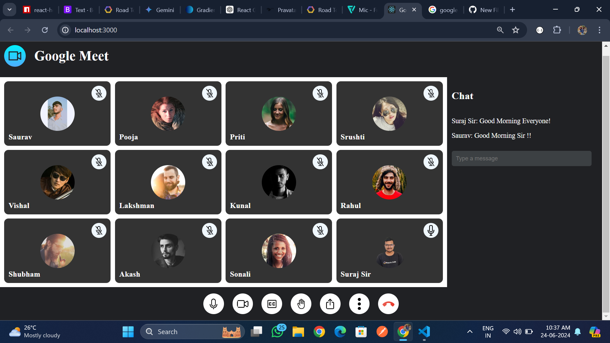

# Google Meet Clone

This is a simple clone of the Google Meet interface built using React.js. It includes a video grid, control buttons, and a chat panel

## Features

- Video grid for participants
- Control buttons for microphone, video, chat, and leave
- Chat panel

## Screenshot

